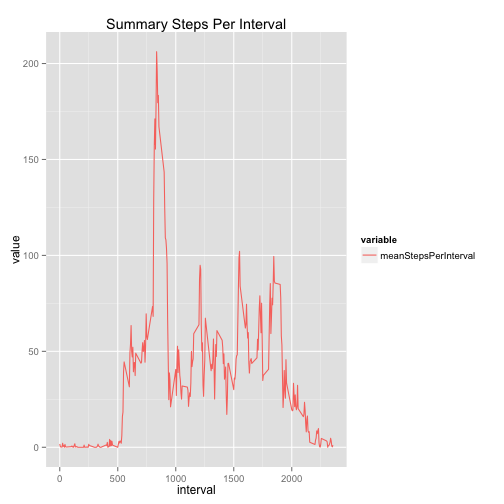

```r
#install.packages('dplyr')
#install.packages('gplot2')
#install.packages('reshape2')
library(dplyr)
library(ggplot2)
library(reshape2)
```

```r
getData <- function(){
    activity<-read.csv(file = 'activity.csv', stringsAsFactors=FALSE)
    activity$date<-as.Date(strptime(activity$date, format='%Y-%m-%d'))
    activity
}
activity <- getData()
```


## Summarazation  


```r
activitySum <- sum(na.omit(activity$steps))
totalSteps      <-activity %>% summarise('TotalSteps' = sum(na.omit(steps)))

summaryStepsPerDay<-activity %>% group_by(date) %>% summarise('medianStepsPerDay' = median(na.omit(steps)), 'meanStepsPerDay' = mean(na.omit(steps)), 'TotalStepsPerDay' = sum(na.omit(steps)), 'minStepsPerDay' = min(steps, na.rm=TRUE) , 'maxStepsPerDay' = max(steps, na.rm=TRUE) )
summaryStepsPerDay$dt <- ts(summaryStepsPerDay$date)


summaryStepsPerInterval<-activity %>% group_by(interval) %>% summarise('medianStepsPerInterval' = median(na.omit(steps)), 'meanStepsPerInterval' = mean(na.omit(steps)), 'TotalStepsPerInterval' = sum(na.omit(steps)), 'minStepsPerInterval' = min(steps, na.rm=TRUE) , 'maxStepsPerInterval' = max(steps, na.rm=TRUE) )
# summaryStepsPerInterval$dt <- ts(summaryStepsPerInterval$date)

startDate   <- min(activity$date)
endDate     <- max(activity$date)
meanDate    <- mean(activity$date)

smd<-melt(summaryStepsPerDay[complete.cases(summaryStepsPerDay),], id.vars = 'dt')
```

```
## Warning: attributes are not identical across measure variables; they will
## be dropped
```

```r
smi<-melt(summaryStepsPerInterval[complete.cases(summaryStepsPerInterval),], id.vars = 'interval')
```


##### Total Steps  

The total steps for all measurements between 2012-10-01 and 2012-11-30 was 570608.  

##### Summarizations

##### Per Day

```r
title<-'Steps Per Day'

ggplot(data=activity)+aes(x=date)+geom_histogram(aes(y=factor(steps)), stat='identity') + ggtitle(paste('Histogram', title))
```

 

```r
ggplot(data=smd)+aes(x=dt, y=log(value), colour=variable)+geom_line() + ggtitle(paste('Summary', title))
```

 


## What is the mean number of steps taken per day?

##### Per Interval

## Which 5-minute interval, on average across all the days in the dataset, contains the maximum number of steps?

```r
mostActiveInterval<-activity[complete.cases(activity), ] %>% group_by(interval) %>% summarise('m'=sum(steps))
mInterval<-mostActiveInterval[which.max(mostActiveInterval$m),][,1]
```

The interval **835** is the most active interval accross all data in the dataset.


No Scaling

```r
title<-'Steps Per Interval'

ggplot(data=smi)+aes(x=interval, y=value, colour=variable)+geom_line() + ggtitle(paste('Summary', title))
```

 

Scaled by Log

```r
title<-'Steps Per Interval'

ggplot(data=smi)+aes(x=interval, y=log(value), colour=variable)+geom_line() + ggtitle(paste('Summary', title))
```

 


